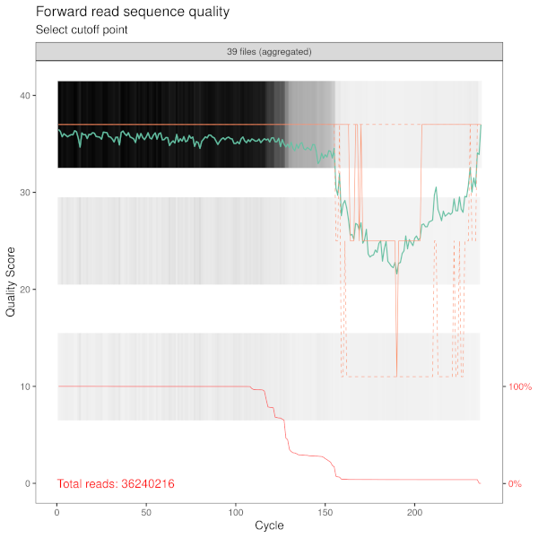
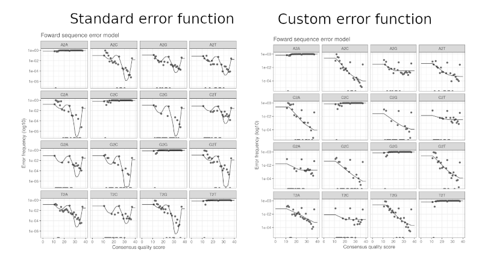

## About The Project

This repository holds a my pipeline to determine taxonomic groups
present in genetic sequencing data. It was created with the 18S and
Eukaryonts in mind, but should be equally applicable to other markers.


## Getting Started

### Expected data format

To use this pipeline, you should start with **paired-end** (one file per
sequencing direction) **demultiplexed** (one sample per file) and
compressed fastq files. The files should be named according to the
`CASAVA` format:

-   SAMPLEID_BARCODE_Lxxx_Rx_xxx.fastq.gz

Where `SAMPLEID` is the name of your sample, `BARCODE` is the barcode
used to mark identify which sample the sequence comes from, `Lxxx` is
the lane number in the sequencing machine where the sample was placed,
`Rx` indicates which read direction the file refers to (R1 means foward,
R2 reverse), `xxx` is the set number.

### Prerequisites

This pipeline was only tested on `Ubuntu 22.04`, but should work on any
Linux or Mac based operating system. It might work on Windows, but it
will be slower because parallel execution will not work.

The [R programming language](https://www.r-project.org/), version 4.2 or
higher is required.

All the heavy work (i.e. math stuff) is done by the
[`dada2`](https://benjjneb.github.io/dada2/index.html) package. My
contribution was automating the location and preparation of file lists,
as well as diagnostic plots so that the analysis can be ran without much
user input.

### Installation

All you need to install is the R programming language, all other
dependencies are installed on demand when you run the application.

#### Ubuntu 22.04

First, install R:

``` sh
# update indices
sudo apt update -qq
# install two helper packages we need
sudo apt install --no-install-recommends software-properties-common dirmngr
# add the signing key (by Michael Rutter) for these repos
# To verify key, run gpg --show-keys /etc/apt/trusted.gpg.d/cran_ubuntu_key.asc 
# Fingerprint: E298A3A825C0D65DFD57CBB651716619E084DAB9
wget -qO- https://cloud.r-project.org/bin/linux/ubuntu/marutter_pubkey.asc | sudo tee -a /etc/apt/trusted.gpg.d/cran_ubuntu_key.asc
# add the R 4.0 repo from CRAN -- adjust 'focal' to 'groovy' or 'bionic' as needed
sudo add-apt-repository "deb https://cloud.r-project.org/bin/linux/ubuntu $(lsb_release -cs)-cran40/"
# Install R
sudo apt install --no-install-recommends r-base
```

These instructions were copied from the [official R
repository](https://cloud.r-project.org/bin/linux/ubuntu/).

### Other operating systems

Download the installer [here](https://cloud.r-project.org/).


## Usage

This pipeline consists of a set of R scripts which are prepared to be
used as command line applications. I do not recommend them from a
graphical IDE (such as Rstudio, which is how most R users work), because
parallel operations will often crash these applications.

Let's imagine we have our project setup as such:

    project-folder
    |
    |- scripts
    |   |
    |   |- 01-remove-primer.R
    |   |- 02-determine-sample-sequences-R
    |   `- 03-assign-taxonomy.R
    |- data
    |   |
    |   `- raw-sequencing-data
    |       |
    |       |- 012522RSeuk1391F-mapping.txt
    |       |- mysample1_S1_L001_R1.fastq.gz
    |       `- mysample1_S1_L001_R2.fastq.gz
    |- outputs

Please note that your forward (R1) and reverse (R2) can be in separate
folders.

**STEP 1** - Remove primers If your sequences still have the primers in
the reads, your first step is to remove them. To do so, you'll need to
provide:

-   `data-directory` - where your fastq files can be found\
-   `mapping` - a test file which specified which primer was used for
    each sample\
-   `output` - directory where you want your new, primer-less, fastq
    files to be saved

``` sh
cd project-folder
Rscript ./scripts/01-remove-primer.R --data-directory ./data/raw-sequencing-data --mapping ./data/raw-sequencing-data/012522RSeuk1391F-mapping.txt --output ./output/sequencing-noprimer
```

**STEP 2** - Clean up sequence data and determine unique sequences This
step does a lot of things at once. It will:

1.  Discard any sequence with undetermined base-pairs\
2.  Truncate sequences at a length determined by the user, to avoid low quality sections\
3.  Remove Phix sequences\
4.  Determine what sequences are found often enough to be a true read and which ones are just sequencing errors\
5.  Merge paired-end sequences\
6.  Export a unique sequence table (with and without chimeras) which can then be used to determine taxonomy

You have to provide: 
- `data-directory` - where your fastq files can be found (WITHOUT PRIMER)\
- `error-function` - to determine which sequences are just sequencing errors, `dada2` uses models to determine how likely a nucletide switch is to occur. This works fine with sequencing methods
such as miseq, where the quality of each bp is reported as a continuous interval. In those cases you can ignore this argument. However, if you have a sequencing method that reports binned qualities (such as
novaseq), those models have to be modified. In that case, specify you want to use a `custom-loess` function. See the section *How do I \> Choose an error function* to see how to decide this\
- `output` - directory to export your sequence tables, as well as several diagnostic plots

This example assumed you have novaseq data:

``` sh
Rscript ./scripts/02-determine-sample-sequences-R --data-directory ./output/sequencing-noprimer --error-function custom-loess --output ./outputs/sequence-tables
```

**STEP 3** - Determine taxonomies This step is implemented with
`dada2`'s Naive Bayes classifier. You require:

-   `sequence-table` - Path to the file sequence-table.RDS, which was
    exported in the previous step.\
-   `reference-sequences` - Dataset used to train your classifier. There
    are [some pre-prepared](https://benjjneb.github.io/dada2/training.html) datasets for you to use, maintained by `dada2`'s team\
-   `output` - Where should your classification table be saved to?


## How do I?

### Choose a truncate length?
When you run 02-determine-sample-sequences.R, you will be prompted to provide a to truncate your sequences at. You should also be shown a plot that examined sequence quality vs sequence length. Find a point where the quality seems to drop sharply, or below what is acceptable for you and that's it. See example:



### Choose an error function

If you have binned quality data (see image above, notice how there are 3 distinct gray bands. Those are a heatmap, with clear discrete bins), your error models will be unstable and "wiggly". You can see this in the plot 01-error-model-fit.png. See the comparison below, where the standard error model is on the left and the modified one on the right:



You want to aim for stable, monotonic lines. Also, be aware that I did not come up with this solution, it was lifted from option #4 in [this](https://github.com/benjjneb/dada2/issues/1307#issuecomment-957680971) github comment. The entire thread is worth a read, along with [this one](https://github.com/benjjneb/dada2/issues/791).

## Roadmap

-   [ ] Add code to create custom train datasets using virtualPCR - based on [Nathan Geraldi's code](https://github.com/ngeraldi/eDNA_DADA2_taxonomy_pipeline)

## License

Distributed under the MIT License. See `LICENSE` for more information.


## Contact

Márcio Martins - [\@MarciofcMartins](https://twitter.com/MarciofcMartins) -
[mfcmartins\@ualg.pt](mailto:marciofcmartins@ualg.pt){.email} - [ResearchGate](https://twitter.com/MarciofcMartins)

